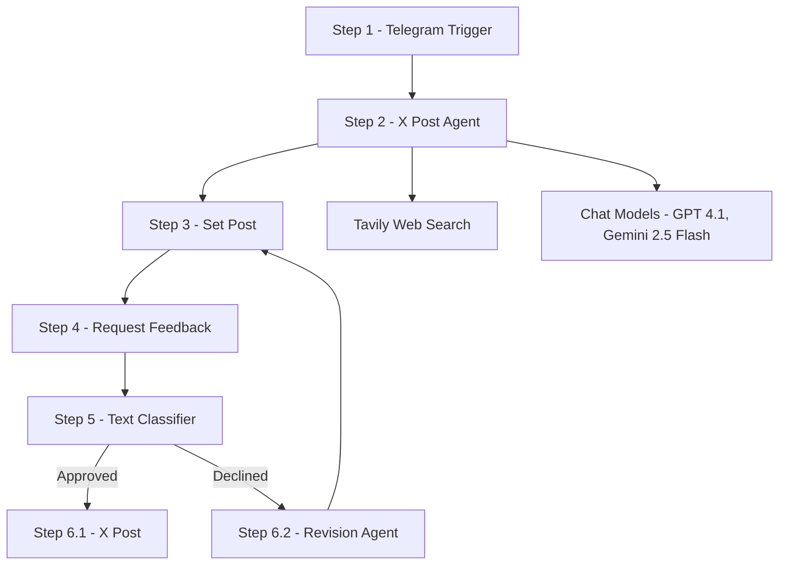

# 📘 Human-in-the-Loop 2.0

      
-black)    

---

## 🔍 Overview
**Human-in-the-Loop 2.0** is an automated workflow designed to create, review, and refine Twitter (X) posts with human oversight. It balances automation with manual feedback to ensure content is accurate, engaging, and aligned with human judgment before publishing.

### Key Benefits
* ✅ **Accuracy** — Combines AI with real-time web search to generate factual posts.
* ✅ **Human Oversight** — Ensures all content is approved or revised before publishing.
* ✅ **Efficiency** — Reduces manual effort while retaining control over final output.

---

## 🖼️ Workflow Image


---

## 📝 Mermaid Diagram


---

## ⚙️ Node-by-Node Configuration

### Step 1: Telegram Trigger
* **Description**: Workflow is triggered by a new Telegram message.
* **Resource**: Message → Updates: message

---

### Step 2: AI Agent (X Post Agent)
* **Description**: Generates a draft X post.
* **Source for Prompt**: `{{ $json.message.text }}`
* **Example Prompt**: *make me an X Post about crocodiles*
* **System Message**:
```
# Overview
You are an AI agent responsible for creating Twitter (X) posts based on user requests.

# Instructions
1. Always use the Tavily Search tool to find accurate, current information about the topic.
2. Write an informative, engaging tweet (up to 280 characters).
3. Include a brief reference to the source (e.g., "via TechCrunch", "according to The Verge").
4. Do not output anything except the final tweet.

# Tool
- Tavily Search: Use this for real-time web search. Must be used every time before creating the post.

# Example
Input: "Create a tweet about NASA’s latest discovery."
Output: "NASA just found signs of ancient riverbeds on Mars—suggesting the Red Planet may have once been home to life. Huge leap in space exploration 🚀 (via NASA) #Mars #SpaceNews"

# Final Notes
- Avoid clickbait or speculation.
- Use hashtags/emojis only to enhance visibility.
- Keep language concise and informative.
- Never use an "@" symbol when referencing sources.
```
* **Tools Used**: Tavily Web Search, GPT-4.1, Gemini 2.5 Flash

---

### Step 3: Set Node (Set Post)
* **Mode**: Manual Mapping
* **Fields to Set**:
  * `post = {{ $json.output }}`

---

### Step 4: Request Feedback
* **Description**: Sends generated post to human via Telegram.
* **Operation**: Send and Wait for Response
* **Message**:
```
Good to go?

{{ $json.post }}
```
* **Response Type**: Free Text

---

### Step 5: Text Classifier
* **Description**: Classifies human response into Approved or Declined.
* **Text to Classify**: `{{ $json.data.text }}`
* **Categories**:
  * **Approved** → e.g., "Looks good", "Approved", "No change needed".
  * **Declined** → e.g., "make it shorter", "change the source", "more emojis".

---

### Step 6.1: X Post (if Approved)
* **Description**: Publishes approved post to Twitter (X).
* **Operation**: `create:tweet`

---

### Step 6.2: Revision Agent (if Declined)
* **Description**: Revises post based on human feedback.
* **Prompt (User Message)**:
```
Here is the post to revise: {{ $('Set Post').item.json.post }}
Here is the Human Feedback: {{ $json.data.text }}
```
* **System Message**:
```
# Overview
You are an expert Twitter writer. Your job is to take an incoming post and revise it based on the feedback the human submitted.

- Do not provide options.
- Choose the best revision.
```
* **Output**: Loops back to Step 3 (Set Post).

---

### Tool: Tavily Web Search
* **Method**: POST
* **URL**: `https://api.tavily.com/search`
* **Auth**: Header Auth → Tavily Credentials AIS
* **JSON Body**:
```json
{
  "query": "{searchTerm}",
  "topic": "general",
  "search_depth": "basic",
  "chunks_per_source": 3,
  "max_results": 1,
  "time_range": null,
  "days": 7,
  "include_answer": true,
  "include_raw_content": false,
  "include_images": false,
  "include_image_descriptions": false,
  "include_domains": [],
  "exclude_domains": []
}
```
* **Placeholder**: `{searchTerm}` = what the user is searching for.

---

## ✅ Benefits
* Reliable, factual content creation with human approval.
* Seamless loop for revisions ensures quality.
* Saves time while maintaining control.
* Extensible for other platforms and integrations.

---

## 📂 Free Template
👉 [Download Here](https://github.com/SachinSavkare/Human-in-Loop-2.0-X-Post-n8n/blob/main/15.1%20Human%20in%20Loop%202.0.json)

---

## 👨‍💻 Author
**Sachin Savkare**  
*Created for: Human-in-the-Loop 2.0 Project*

---
